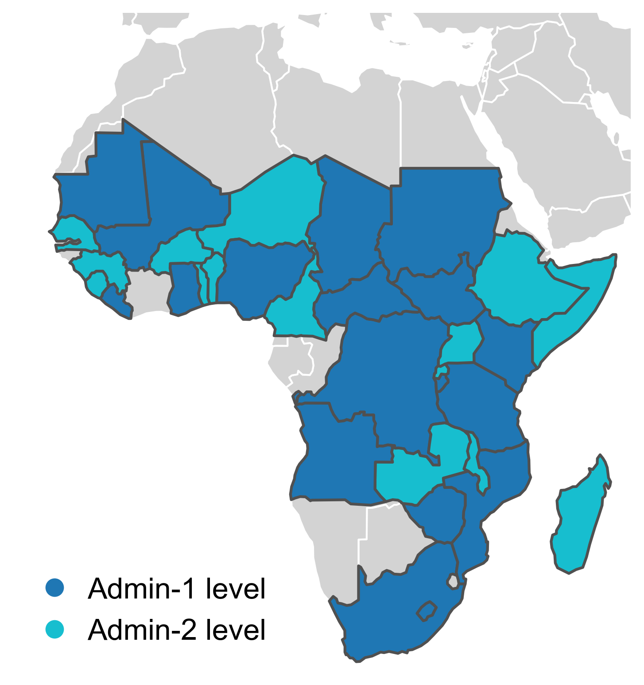

# HarvestStat-Africa: Open-Access Harmonized Subnational Crop Statistics


<!-- 
 -->

## Overview

The HarvestStat-Africa is a repository that contains cleaned and harmonized subnational global crop production data for Africa from various sources, including the Famine [Early Warning Systems Network (FEWS NET)](https://fews.net/) of the U.S. Department of State Office of Global Food Security and the Food and Agriculture Organization (FAO).</br>

This repository provides access to a comprehensive crop dataset that allows researchers, policymakers, and stakeholders to explore trends and patterns from  the subnational to the global level, enabling better-informed decisions related to food security, trade, and development.</br>

## Data sources

The data in this repository are compiled from the following sources:

- **Famine Early Warning Systems Network (FEWS NET)** (primary source)  
  - [FEWS NET Data Warehouse (FDW)](https://fews.net/data)
- **Food and Agriculture Organization of the United Nations (FAO)**  
  - [FAOSTAT](https://www.fao.org/faostat/en/#home)
- National agricultural agencies

## Repository structure

The repository is organized as follows:

- `data/` – Raw and intermediate crop statistics generated during internal processing  
- `docs/` – Documentation related to the dataset  
- `figures/` – Figures generated during data processing and analysis  
- `notebooks/` – Jupyter notebooks and Python scripts for country-level data processing  
- `public/` – Semi-final and final processed datasets (CSV, Parquet, and GeoPackage formats) intended for public use  

## Setting up the environment

This project uses [uv](https://docs.astral.sh/uv/) to manage Python dependencies. uv is a fast, cross-platform package manager that works identically on macOS, Windows, and Linux.

### 1. Install uv

**macOS / Linux:**
```bash
curl -LsSf https://astral.sh/uv/install.sh | sh
```

**Windows (PowerShell):**
```powershell
powershell -ExecutionPolicy ByPass -c "irm https://astral.sh/uv/install.ps1 | iex"
```

Or via Homebrew (macOS), winget (Windows), or pipx — see the [uv install guide](https://docs.astral.sh/uv/getting-started/installation/).

### 2. Clone and sync

```bash
git clone https://github.com/HarvestStat/HarvestStat-Africa.git
cd HarvestStat-Africa
uv sync
```

`uv sync` reads `pyproject.toml` and `uv.lock`, installs the pinned Python version (3.11), creates a `.venv/` in the project root, and installs all dependencies. This works the same on every OS.

### 3. Set up notebook output stripping (contributors only)

This project uses [`nbstripout`](https://github.com/kynan/nbstripout) to prevent notebook outputs from being committed. After cloning, run once:

```bash
uv sync --group dev
uv run nbstripout --install
```

This registers a git filter that automatically strips cell outputs before staging any `.ipynb` file.

### 4. Run notebooks

```bash
uv run jupyter lab
```

Or activate the environment directly:

- macOS / Linux: `source .venv/bin/activate`
- Windows (PowerShell): `.venv\Scripts\Activate.ps1`
- Windows (cmd): `.venv\Scripts\activate.bat`

### Adding a dependency

```bash
uv add <package>          # adds to pyproject.toml and updates the lockfile
uv remove <package>       # removes a dependency
uv lock --upgrade-package <package>   # bump a single dependency
```

## Data access and status

Processed datasets are available in the `public/` directory. Available files include:

- `README.md` – Dataset documentation  
- `CHANGELOG.md` – Version history and updates  
- `hvstat_africa_data_{version}.csv` – Final harmonized crop statistics  
- `hvstat_africa_boundary_{version}.gpkg` – Subnational administrative boundary data  

The dataset version is specified in the filename.

The current release is **`v1.1`**, which includes subnational crop statistics for **33 countries**:

- **Admin-1 level**:  
  Angola, Burundi, Central African Republic, Chad, Democratic Republic of the Congo, Ghana, Kenya, Lesotho, Liberia, Mali, Mauritania, Mozambique, Nigeria, South Africa, South Sudan, Sudan, Tanzania, Zimbabwe

- **Admin-2 level**:  
  Benin, Burkina Faso, Cameroon, Ethiopia, Guinea, Madagascar, Malawi, Niger, Rwanda, Senegal, Sierra Leone, Somalia, Togo, Uganda, Zambia



## Data structure

The dataset contains the following variables:

| Column Name             | Description                                                     |
| ----------------------- | --------------------------------------------------------------- |
| `fnid`                  | FEWS NET's unique geographic unit identifier                    |
| `country`               | Name of the country                                             |
| `country_code`          | ISO 3166-1 alpha-2 country code                                 |
| `admin_1`               | Name of the first-level administrative unit                     |
| `admin_2`               | Name of the second-level administrative unit (if applicable)    |
| `product`               | Name of the crop product                                        |
| `season_name`           | Name of the growing season                                      |
| `planting_year`         | Year when planting begins                                       |
| `planting_month`        | Month when planting begins                                      |
| `harvest_year`          | Year when harvesting ends                                       |
| `harvest_month`         | Month when harvesting ends                                      |
| `crop_production_system`| Type of crop production system (e.g., irrigated, rainfed, etc.) |
| `qc_flag`               | Quality control flag (0 = no flag, 1 = outlier, 2 = low variance)|
| `area`                  | Cropped area (hectares; ha)                                     |
| `production`            | Crop quantity produced (metric tonnes; mt)                      |
| `yield`                 | Crop yield (metric tonnes per hectare; mt/ha)                   |

> We note that the crop calendar variables (`planting_year`, `planting_month`, `harvest_year`, `harvest_month`) were introduced to distinguish multi-season systems and seasons that span across calendar years; they do **not** represent actual phenological timing.

For details, please see the paper in the [Citation](#citation) section.

## Citation
The data in this repository is available for free and unrestricted use. Users are encouraged to cite the following:

Lee, D., Anderson, W., Chen, X. et al. HarvestStat Africa – Harmonized Subnational Crop Statistics for Sub-Saharan Africa. Sci Data 12, 690 (2025). [https://doi.org/10.1038/s41597-025-05001-z](https://doi.org/10.1038/s41597-025-05001-z).

<details>
<summary>BibTeX</summary>
<pre>
@article{lee_eaxv2024,
  author       = {Lee, Donghoon and
                  Anderson, Weston and
                  Chen, Xuan and
                  Davenport, Frank and
                  Shukla, Shraddhanand and
                  Sahajpal, Ritvik and
                  Budde, Michael and
                  Rowland, James and
                  Verdin, Jim and
                  You, Liangzhi and
                  Ahouangbenon, Matthieu and
                  Davis, Kyle Frankel and
                  Kebede, Endalkachew and
                  Ehrmann, Steffen and
                  Justice, Christina and
                  Meyer, Carsten},
  title        = {{HarvestStat Africa – Harmonized Subnational Crop Statistics for Sub-Saharan Africa}},
  year         = {2025},
  volume       = {12},
  number       = {690},
  journal      = {Scientific Data},
  doi          = {10.1038/s41597-025-05001-z},
  url          = {https://doi.org/10.1038/s41597-025-05001-z}
}
</pre>
</details>

## How to contribute
Contributions to this repository are welcome, including new data sources or improvements to the existing data. To contribute, please create a pull request with a clear description of the changes proposed.

## Contact 
- Please contact Donghoon Lee ([Donghoon.Lee@umanitoba.ca](Donghoon.Lee@umanitoba.ca)) and Weston Anderson ([Weston@umd.edu](Weston@umd.edu)) for any questions or collaborations.</br>
- Users are encouraged to [open an issue](https://github.com/HarvestStat/HarvestStat/issues) for questions, feedback, or bug reports.

## License
The data in this repository is licensed under the MIT License.
